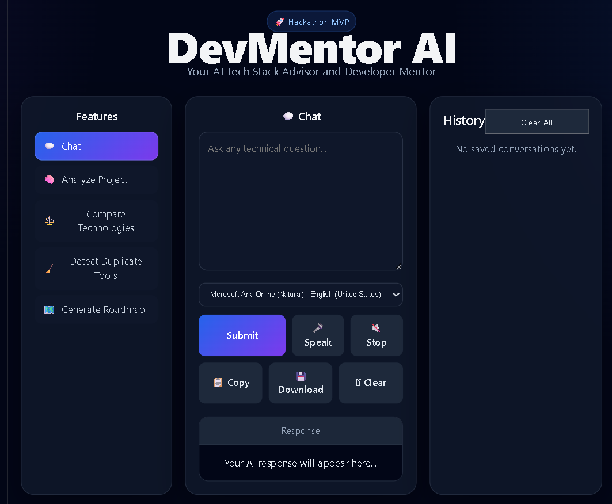
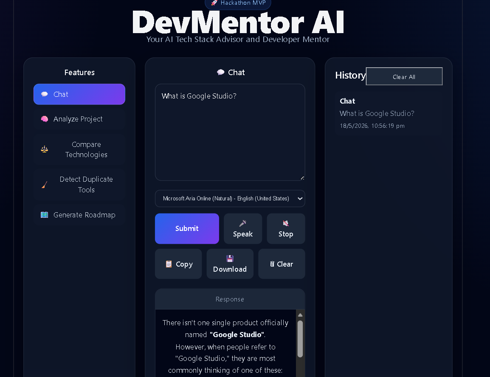
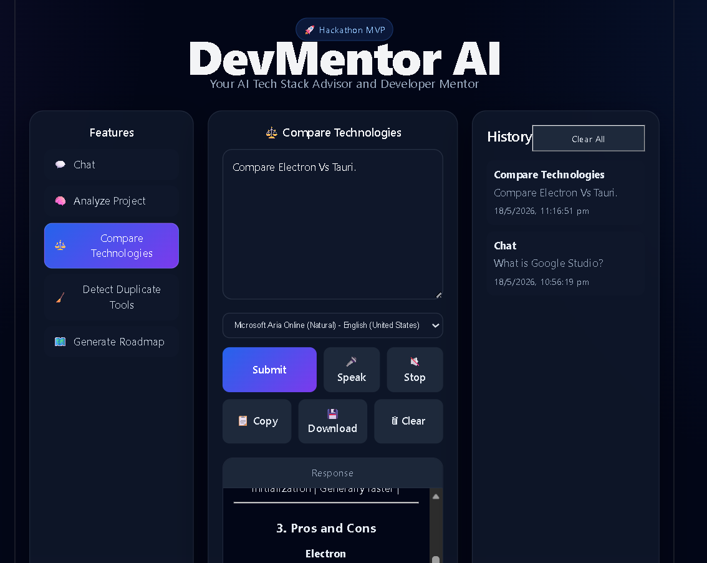

# 🚀 DevMentor AI

> **Your AI Tech Stack Advisor and Developer Mentor**

DevMentor AI is a voice-enabled AI assistant that helps developers and students:

* Analyze project ideas
* Compare technologies
* Detect redundant tools
* Generate personalized learning roadmaps
* Chat naturally using text or voice

Built with **FastAPI**, **React**, **Gemini API**, and browser-based speech technologies.

---

## Why DevMentor AI?

Students and developers often struggle to choose the right tools, avoid redundant technologies, and plan effective learning paths.

DevMentor AI acts as a personalized technical mentor that helps users make better architectural decisions, understand modern technologies, and accelerate project development through natural text and voice interaction.

## ✨ Features

### 💬 AI Chat

Ask technical questions and receive detailed, structured explanations.

### 🧠 Project Analyzer

Describe your project idea and get:

* Architecture suggestions
* Recommended tech stack
* Potential challenges
* Improvement ideas

### ⚖️ Technology Comparison

Compare tools and frameworks such as:

* Electron vs Tauri
* LangChain vs LangGraph
* FastAPI vs Django

### 🧹 Duplicate Tool Detection

Identify overlapping tools and simplify your stack.

### 🗺️ Learning Roadmap Generator

Generate personalized study plans for any technical goal.

### 🎤 Voice Interaction

* Speech-to-text input
* Text-to-speech output
* Selectable voices

### 📋 Productivity Tools

* Copy responses
* Download responses as Markdown
* Clear current session
* Persistent conversation history

### 📝 Markdown Rendering

Beautiful formatting for headings, lists, tables, and code blocks.

---

## 🖼️ Screenshots

> Add screenshots to `docs/screenshots/` and update these paths.

### Main Dashboard

```markdown

```

### Response

```markdown

```

### History Panel

```markdown

```

---

## 🎥 Demo Video

[Watch the demo video](YOUR_VIDEO_LINK)

---

## 🏗️ Architecture

```text
User (Text / Voice)
        ↓
React Frontend (Vite)
        ↓
FastAPI Backend
        ↓
Gemini API
        ↓
Structured AI Response
```

---

## 🛠️ Tech Stack

### Frontend

* React
* Vite
* React Markdown
* Web Speech API
* LocalStorage

### Backend

* FastAPI
* Uvicorn
* Google Gemini API
* Python-dotenv

### AI Model

* Google Gemini 2.x

### Tooling

* Git & GitHub
* VS Code
* WSL Ubuntu

---

## ⚡ Quick Start

```bash
git clone https://github.com/108-TusharBK/devmentor-ai.git
cd devmentor-ai
pip install -r requirements.txt
cd apps/frontend && npm install

---

## 📁 Project Structure

```text
devmentor-ai/
├── apps/
│   ├── backend/
│   │   ├── app/
│   │   │   ├── api/
│   │   │   ├── config/
│   │   │   └── services/
│   │   └── main.py
│   └── frontend/
│       ├── src/
│       │   ├── App.jsx
│       │   └── App.css
│       └── package.json
├── docs/
├── prompts/
├── scripts/
├── tests/
├── .env
├── .gitignore
├── requirements.txt
└── README.md
```

---

## ⚙️ Installation

### 1. Clone Repository

```bash
git clone https://github.com/108-TusharBK/devmentor-ai.git
cd devmentor-ai
```

### 2. Backend Setup

```bash
python3 -m venv .venv
source .venv/bin/activate
pip install -r requirements.txt
```

### 3. Configure Environment Variables

Create `.env` in the project root:

```env
GEMINI_API_KEY=your_api_key_here
```

### 4. Frontend Setup

```bash
cd apps/frontend
npm install
```

---

## ▶️ Running the Application

### Start Backend

```bash
cd apps/backend
source ../../.venv/bin/activate
uvicorn main:app --reload
```

Backend URL:

```text
http://127.0.0.1:8000
```

### Start Frontend

```bash
cd apps/frontend
npm run dev
```

Frontend URL:

```text
http://127.0.0.1:5173
```

---

## 🎤 Voice Usage

1. Click **Speak**.
2. Ask your question.
3. Click **Submit**.
4. Listen to the spoken response.
5. Choose a preferred voice from the dropdown.

---

## 💡 Example Prompts

### Chat

* What is Ollama?
* Explain FastAPI in simple terms.

### Analyze Project

* Build an AI desktop mentor for developers.

### Compare Technologies

* Electron vs Tauri
* LangChain vs LangGraph

### Detect Duplicate Tools

* LangChain, LangGraph, CrewAI, AutoGen

### Generate Roadmap

* Learn Embedded AI and Edge ML.

---

## 🏆 Hackathon Highlights

This project demonstrates:

* AI-powered developer assistance
* Voice interaction
* Technology recommendation engine
* Persistent local history
* Modern, polished UI

---

## 🔮 Future Roadmap

### Near-Term

* Electron desktop packaging
* PDF export
* Rich markdown themes
* Session-based multi-turn memory

### Long-Term Vision

* IDE integration (VS Code, Cursor)
* System tray assistant
* Screen understanding (OCR)
* Cross-platform desktop application
* J.A.R.V.I.S.-style always-available mentor

---

## 🤝 Contributing

Contributions, issues, and feature requests are welcome.

1. Fork the repository.
2. Create a feature branch.
3. Commit changes.
4. Open a pull request.

---

## 👨‍💻 Author

**Tushar Kale**

* GitHub: - [108-TusharBK](https://github.com/108-TusharBK)

---

## ⭐ Support

If you found this project useful, please consider starring the repository.

---

## 🧠 Inspiration

DevMentor AI was created to reduce the friction students and developers face when choosing tools, understanding technologies, and building projects.

The long-term goal is to evolve it into a full-featured AI mentor and coding companion.

---

## 🏆 Hackathon Submission

This project was built for the TechEx Intelligent Enterprise Solutions Hackathon hosted by lablab.ai.

---

## 📄 License

This project is licensed under the MIT License.

---

